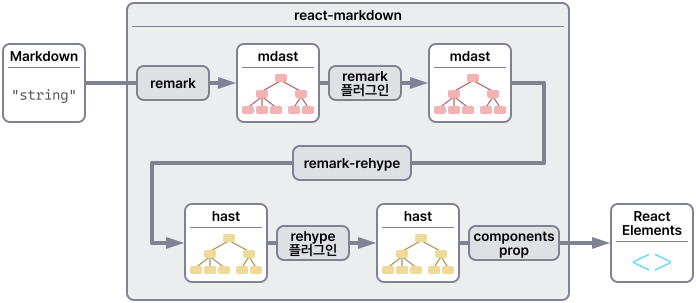
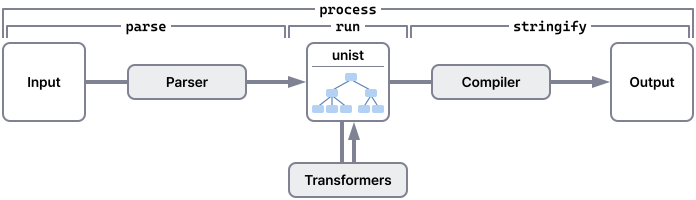
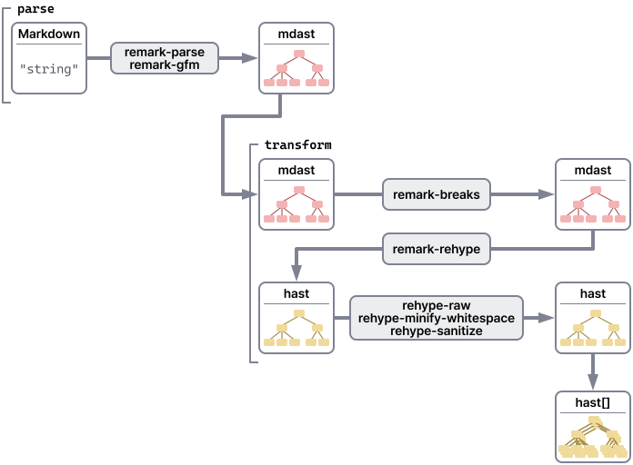
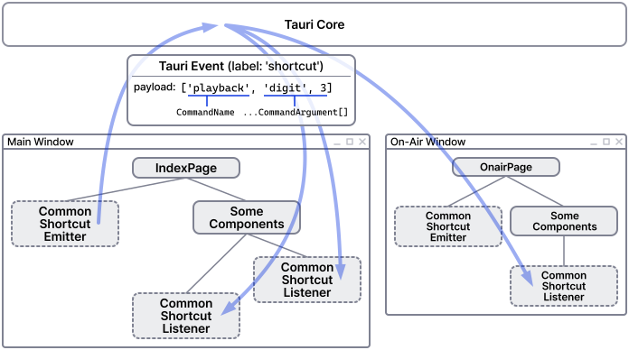
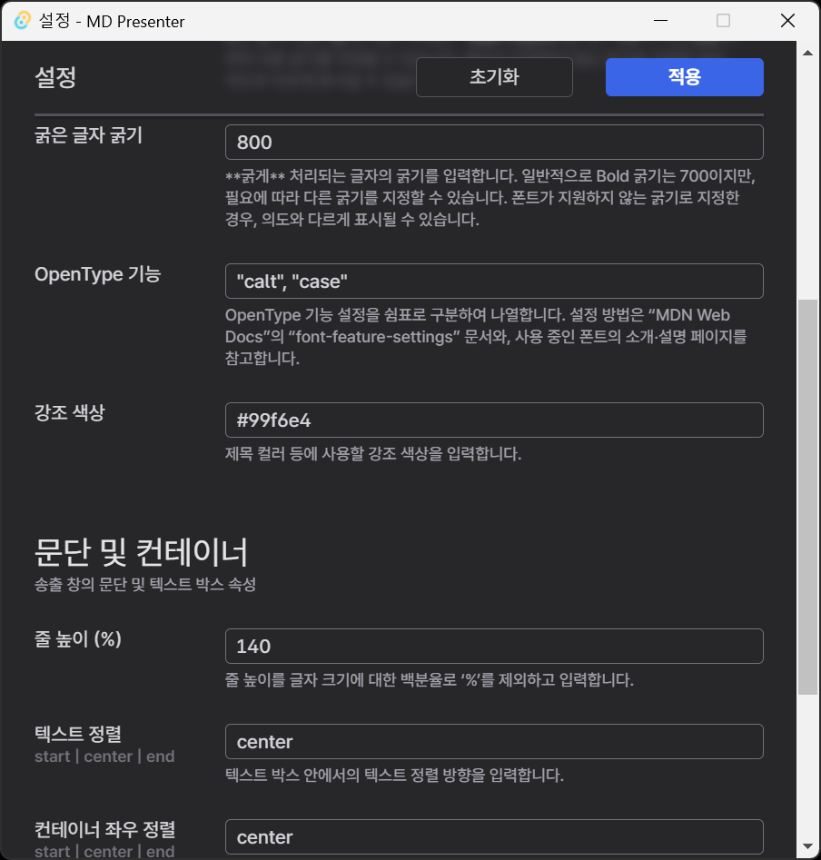

2023년 겨울, 내가 출석하는 교회의 청년부에서는 정말 오랜만에 교회 외부 장소를 대관하여 동계수련회를 진행했다. 나는 가사 등의 자막 송출 준비 등을 담당했고, 자막을 어떻게 만들고 송출할지 고민했다. PowerPoint를 이용한 자막 송출은, 가장 잘 알려진 방법이면서도 편집의 자유도가 높다. 하지만 나는 여러 가지 이유로 PowerPoint로는 가사 자막 송출을 하고 싶지가 않았다.

- 나는 평소에 방송용 문자 발생기<small>(Character generator)</small>를 다뤄서 그 시스템에 익숙해져 있다. <small>(Preview에 먼저 올려놓아서 송출될 내용을 확인한 다음에 Program으로 넘기는 방식)</small>
- PowerPoint 버전에 따라서, 발표자 도구의 ‘모든 슬라이드 보기’ 상태에서 아무 페이지를 클릭하면,
  - ‘모든 슬라이드 보기’ 모드가 해제된다. 하지만 나는 슬라이드 쇼 창과 동기화되는 페이지 리스트를 항상 띄워 놓고 싶다.
  - 가끔씩 전혀 다른 페이지로 이동하는 버그가 발생한다. <small>(아직도 재현 방법을 모르겠고, 고쳐졌는지도 모르겠다.)</small>
- 발표를 위한 편의 기능이, 오히려 사고의 원인이 된다. <small>(마우스를 움직였을 때 마우스 커서가 노출되면서 슬라이드 쇼 제어 UI가 표시되는 것 등)</small>

이런 이유로 이전에 만들어 놓은 텍스트 프레젠터가 있었다. 하지만 문제가 있었다. 이제 와서 고치려니 엄두가 안 났다. 결국 기존 것을 버리고 [MD Presenter](https://github.com/yejunian/mdpresenter)라는 Markdown 기반의 프레젠터를 새로 만들기로 했다. 애플리케이션의 기능 등, 자세한 내용은 [README 파일](https://github.com/yejunian/mdpresenter/blob/release/0.1.0/README.md)을 참고하기 바란다.

> Markdown 파일을 불러와 프레젠테이션을 진행하는 데 쓰입니다.
>
> 하지만 이미 괜찮은 유료·무료 프레젠테이션 애플리케이션이 많이 나와 있어서, 웬만하면 그걸 쓰는 게 좋겠습니다. 일반적인 슬라이드 작업에서는 그쪽의 편집 자유도가 더 높기 때문입니다.

---

## 고민과 결정

MD Presenter에 대한 아이디어를 내고 결과물을 만들기까지 여러 가지 고민이 있었다.

### 고민 1: Continue vs Restart

#### 텍스트 프레젠터를 만든 과거의 기억

대학생 시절, 같은 용도로 텍스트 프레젠터를 몇 번 만든 적이 있다. 처음에는 <mark>웹 프론트엔드</mark>로 만들었고, 그 다음에는 <mark>C#, WPF</mark><small>(Windows Presentation Foundation)</small>로 만들었다. 둘 다 작동은 하는 수준이고, 효율성이나 유지보수 측면에서 잘 만들어지지는 않았다.

처음으로 만든 <mark>웹 버전</mark>에서는 사용자가 on-air 이전에 미리 송출 창을 띄우고, 직접 보조 디스플레이로 옮기고, 전체 화면을 활성화해야 했다. 당시<small>(2010년대 중후반)</small> 웹에서는 원하는 디스플레이에 바로 창을 띄울 방법이 없었던 것으로 기억한다. Chrome 100 버전부터 사용 가능한 [Multi-Screen Window Placement API를 소개하는 아티클](https://developer.chrome.com/articles/multi-screen-window-placement/)에서도 두 번째 화면의 스펙을 알 방법이 없었다고<small>(<cite>there is no way to know the dimensions of the second screen</cite>)</small> 말한다. 또 무슨 기준인지는 모르겠으나, 마우스 커서가 전체 화면이 활성화된 송출 창 위를 지날 때 전체 화면 종료 방법 안내가 표시될 때도 간혹 있었다.

그런 부자연스러움을 해소하기 위해 WPF 버전을 만들었다. <mark>WPF 버전</mark>에서는 사용자가 지정한 디스플레이에 전체 화면으로 송출 창이 표시되도록 하여, 앞서 기술한 웹 버전에서의 문제점을 해결했다. 여기에 더해서 몇 가지 기능을 더 넣기도 했다.

#### 이어 하기 vs 새로 하기

올해 초, 거의 4년 만에 WPF 버전의 텍스트 프레젠터를 열어 봤는데, 설정 저장에도 오류가 있고, 그 외 고치고 싶은 점도 몇 가지 보였다. 하지만 곧 고민을 하기 시작했다.

- WPF 버전의 텍스트 프레젠터를 유지보수하려니,
  - 너무 오랜만에 C#을 다뤄야 하는 상황이다. C#은 간단하게만 배웠기에, 다시 잡기가 부담스럽다.
  - 코드 상태도 별로 안 좋은 것 같다. 내 기억에, 코드를 체계적으로 분리해 놓지는 않았었다.
- 내가 가장 자신 있는 프로그래밍 언어는 JavaScript이다. 여기에 몇 가지를 보조하기 위해서 TypeScript를 주로 사용하고 있다.
  - [Tauri](https://tauri.app/)나 [Electron](https://www.electronjs.org/)으로, 번거롭지만 다시 만드는 쪽이 과정은 물론이고 결과도 더 좋지 않을까?
  - 그러면 macOS 지원 고민도 덜 수 있지 않을까?

이런저런 고민을 하다가 <mark>Tauri</mark>로 처음부터 다시 만들어 보기로 결정하고, 공식 문서를 보고 Playground 프로젝트를 만들어서 가지고 놀았다.

### 고민 2: MPA vs Next.js를 이용한 SSG

이 주제로는 아직까지도 고민을 하고 있다. MD Presenter는 여러 개의 창으로 구성되어 있다. 모든 창을 Next.js 기반 SPA 하나로 만들 수도 있겠고, 각 창이 개별 페이지로 구성된 MPA로 만들 수도 있겠다.

[Next.js](https://nextjs.org/)를 사용하면 간단한 세팅만으로도 URL 라우팅, 정적 페이지 생성 등이 가능하다. 하지만 MD Presenter에서는 각 창에서의 페이지 이동이 없어서 라우팅 기능의 반쪽만을 사용하게 되고, 그 밖의 기능도 별로 사용하지 않아서 <small>(빌드할 때 불필요한 부분이 어느 정도는 정리가 되겠지만)</small> 창 초기화 비용도 커질 수 있겠다.

각 창마다 페이지를 따로 만들어서 띄우는 경우, 개별 창에서 필요한 수준으로 의존성을 결정할 수 있겠다. 하지만 빌드 세팅을 직접 해야 한다. 따라서 일단 빠른 진행을 위해 <mark>Next.js</mark>를 사용하기로 했다.

### 고민 3: Markdown 확장·변경 범위

#### 페이지 나누기

지금 만들려는 건 프레젠터 애플리케이션이고, 페이지를 적당한 기준에 따라서 나누어야 한다. **페이지를 나누는 방법 두 가지**를 떠올렸다.

**첫째는 한 블록을 한 페이지로 만드는 것이다.** 여기서 한 ‘블록’이란, Markdown 문서 루트의 각 자식 트리를 가리킨다. 이 방법으로 페이지를 나누었을 때, \[제목 + 문단], \[문단 + 문단] 등 여러 블록으로 구성된 페이지를 만들려면 `<div>` 등으로 감싸야 한다. 각 페이지의 내용이 간결하게 한 블록으로 들어가는 경우가 많다면, 이 방법을 적용하는 쪽이 문서를 더 신속하게 만들 수 있다.

**둘째는 가로선<small>(`<hr>`로 변환되는 것)</small> 단위로 페이지를 나누는 것이다.** 전자보다는 좀 더 명시적인 페이지 분리 방법이다. 각 페이지의 내용이 간결하게 한 블록으로 들어가는 경우가 많다면, 이 방법은 전자에 비해 문서를 신속하게 만들기가 불리하다.

나는 <mark>한 블록을 한 페이지로</mark> 만드는 방법을 선택했다. 하지만 그 방법으로는 빈 페이지를 넣기가 불편하다. `&nbsp;`만 들어간 문단을 넣는 등의 방법을 써야 하는데, 편집할 때 눈에 잘 안 띌 수 있다. 따라서 <mark>가로선을 ‘빈 페이지’로</mark> 의미를 변경하여 사용하기로 했다.

#### 메모 기능

PowerPoint에는 슬라이드 노트 기능이 있지만, 페이지 리스트 뷰에서는 보이지 않는다. 나는 페이지 리스트에서도 보이는 메모 기능을 넣고 싶었다. Markdown을 확장하는 방법은 여러 가지가 있겠지만, **일반적인 Markdown과 호환될 수 있는 방법으로** 확장하고 싶었다. 메모는 송출 화면에 출력되지 않는다는 점을 생각하여, <mark>HTML 주석</mark>(`<!--` ... `-->`)을 이용하여 메모 기능을 지원하기로 했다.

#### 스타일링

필요에 따라 개별 페이지 또는 하위 요소에 전역<small>(global)</small> 스타일 대신 별도의 스타일을 적용하고 싶을 수 있다. 하지만 Markdown을 HTML 등으로 변환하는 일반적인 라이브러리는 보안상의 이유로 허용되는 요소<small>(element)</small>와 속성<small>(attribute)</small>만 남기고 나머지는 삭제한다. 여기서 `style`과 `class` 속성을 추가로 허용하여, 일단 인라인 스타일을 지정할 수 있게 했다. 추후 유틸리티 클래스 등도 적용할 수 있게 할까 생각 중이다.

### 고민 4: Tailwind CSS

이 고민은 앞의 스타일링 지원과 맞물려 있기도 하다. Markdown 파일에서 사용할 유틸리티 클래스를 독자적으로 정의하면 여기에 따른 레퍼런스 문서도 만들어야 한다. 이미 문서가 만들어져 있는 걸 가져오면 어떨까 하는 생각과 함께, 오래전 맛보기로 써 봤던 Tailwind CSS를 떠올렸다.

마침 Tailwind CSS에는 잘 만들어진 컬러 팔레트도 있다. `className`이 지저분해 보일 수 있긴 하지만, UI를 스타일링하기 위한 다양한 기능이 있기도 해서 Tailwind CSS를 일단 붙여 보기로 했다. <small>(컬러 팔레트와 breakpoint prefix가 Tailwind CSS를 선택하는 데 가장 큰 영향을 주었다.)</small> 다만, Tailwind CSS는 잘못 사용하면 부모-자식 컴포넌트 사이에서 `className`이 충돌할 위험이 있다는 점에서 주의가 필요했다.

이걸 고민할 당시에 CSS in JS는 선택지에 없었는데, 한 컴포넌트가 한 파일로 구성되는 것을 보니 충분히 고민해 볼 가치가 있었을 것 같다. 나중에 Next.js를 걷어낸다면, 그때 다시 고민해 봐야겠다.

---

## ‘큰 산’과 해결 과정

MD Presenter의 핵심 기능을 구현하면서 크고 작은 어려움이 있었다. 핵심적인 부분과 부가적인 부분을 나눠서 정리해 보았다. 먼저 핵심적인 부분이다.

### 큰 산 1: Markdown 파싱 및 페이지 분리

이전에 만든 것은 Markdown의 극히 일부분만을 지원하는 텍스트 프레젠터여서, 페이지 분리, 페이지 내 개행, 제목 페이지 정도만 신경 쓰면 간단하게 해결되었었다. 하지만 이번에는 본격적으로 Markdown 문서를 처리해야 한다. 다행히 이미 Markdown 처리 관련 라이브러리가 잘 만들어져 있다. 나는 그중 `react-markdown`을 살펴보았다.

#### `react-markdown`의 아키텍처



[`react-markdown`](https://github.com/remarkjs/react-markdown)은 Markdown string을 입력받아서 React 엘리먼트로 안전하게 렌더링해 주는 React 컴포넌트이다. Markdown 문서를 string으로 받고, `remark`, `remark` 플러그인, `remark-rehype`, `rehype` 플러그인을 거쳐서 최종적으로 React 엘리먼트를 리턴한다. README의 [아키텍처](https://github.com/remarkjs/react-markdown#architecture) 그림 바로 다음에는 `unified`가 무슨 동작을 하는지 이해해야 한다고 말하고 있어서, `unified`의 아키텍처도 함께 살펴보았다.

#### `unified`의 아키텍처

[`unified`](https://github.com/unifiedjs/unified)는 콘텐츠를 syntax tree와 함께 처리하기 위한 인터페이스이다. 텍스트 콘텐츠를 syntax tree로 변환하거나, syntax tree를 텍스트 콘텐츠나 다른 syntax tree로 변환하는 등의 작업이 가능하다.



`unified`의 [아키텍처](https://github.com/unifiedjs/unified#overview)를 보면, 크게 4가지 작업이 가능하다.

- `parse`: 텍스트를 syntax tree로 파싱
- `run`: Syntax tree를 다른 syntax tree로 변환
- `stringify`: syntax tree를 콘텐츠로 컴파일
- `process`: 위의 3가지 작업을 차례로 모두 수행

#### MD Presenter의 처리 방법

페이지 리스트와 송출 창에 페이지 콘텐츠를 표시하기 위해 구상한 방법은, Markdown 문서 루트 노드의 각 자식을 개별 문서로 나누어 두는 것이었다. 다시 말해서, 처리 결과로 syntax tree의 배열을 얻으려 했다. 하지만 `react-markdown`은 React 엘리먼트를 돌려준다. 내가 원하는 결과를 얻으려면 `unified`와 함께 적당한 플러그인을 조합하여 처리해야 했다.

나는 다음과 같은 처리 절차를 구성했다.



1. **Parse**: Markdown → `remark-parse`, `remark-gfm` → [mdast](https://github.com/syntax-tree/mdast)
2. **Run**: mdast → `remark-breaks`, `remark-rehype` → [hast](https://github.com/syntax-tree/hast)
3. **Run**: hast → `rehype-raw`, `rehype-minify-whitespace`, `rehype-sanitize` → hast
4. hast → hast\[] <small>(이 단계에서 가로선을 이용한 빈 페이지, 주석을 이용한 페이지 메모 처리)</small>
5. hast\[]를 보관해 두었다가, 개별 엔트리를 필요에 따라 사용
   - **Stringify**: hast → `rehype-react` → React 엘리먼트 <small>(페이지 리스트 항목, 송출 창 콘텐츠 등)</small>
   - PVW/PGM 변경 이벤트 발생 시 페이로드로 hast를 전달

### 큰 산 2: 키보드 입력 처리



키보드 입력 핸들링을 구현하는 과정에서, `else if` 또는 `switch` 지옥을 피하기 위한 고민을 했다. CLI 애플리케이션에서 각 명령어가 세부 명령어로 쪼개지기도 하는 것을 보고, 기능에 따라 묶어서 처리하는 방법을 생각했다. 그리고 키맵과 관련된 타입을 다음과 같이 정의했다.

```typescript
type Keymap = {
  [combination: string]: ShortcutCommand
}

type ShortcutCommand = [CommandName, ...CommandArgument[]]

type CommandName = 'main' | 'onair' | 'file' | 'playback'
type CommandArgument = boolean | number | string
```

여기서 `Keymap`의 `combination`은, 보조 키 입력이 없는 경우 `{KeyboardEvent.code}`<small>(예: <kbd><small>Num </small>/</kbd> → `NumpadDivide`)</small>, 보조 키 입력이 있는 경우 `{KeyboardEvent.code}_a?c?m?s?`<small>(예: <kbd>Ctrl</kbd>+<kbd>O</kbd> → `KeyO_c`)</small> 형태가 되도록 정의했다.

그리고 `window` 객체에 `keydown` 이벤트 핸들러를 붙였다. 핸들러는 입력한 키 조합을 `Keymap`의 key string으로 만들고, 해당 키 조합에 명령이 할당되어 있는지를 검사한다. 명령이 할당된 키 조합이라면, 레이블이 `shortcut`인 Tauri 전역 이벤트를 발생시킨다. 이때, 키 조합에 할당된 명령(`ShortcutCommand`)을 페이로드로 전달한다. 이 내용은 `useCommonShortcutEmitter`라는 hook으로 구현했고, 핸들링이 필요한 키를 입력받는 각 창의 루트 컴포넌트에서 단 한 번씩만 호출된다.

`shortcut` 이벤트 수신을 위해서 `useCommonShortcutListener`라는 hook도 구현했다. 이 hook은 핸들링이 필요한 명령의 핸들러를 모아 놓은 객체를 받아서, `shortcut` 이벤트가 발생했을 때 적절한 핸들러를 호출한다.

### 큰 산 3: 설정 구조

당연하게도 프레젠테이션을 송출하는 곳마다 환경이 다르다. 스크린의 크기, 표시 원리<small>(빔 프로젝터, LCD 패널, OLED 패널 등)</small>, 스크린 밝기<small>(주변광 영향 포함)</small>, 색 공간 등 여러 요인이 다르다. 따라서 항상 동일한 스타일만을 제공하기보다는 환경에 맞게 어느 정도 변경 가능하도록 하는 것이 좋겠다. 그래서 송출 관련한 설정 기능을 구현하고자 했고, 그 구조를 고민했다.

Visual Studio Code는 설정 UI와 JSON 파일, 두 가지 설정 방법을 제공한다. 이를 참고하여 애플리케이션 설정의 구조를 만들었다. 설정 저장은 JSON으로 하되, 설정 UI를 위해 설정 항목과 관련된 타입도 함께 정의하고 내용을 채웠다. 설정 UI에서 카테고리별로 영역이 나누어지도록 아래와 같이 설정 항목의 타입을 정의했다.

```typescript
type ConfigContents = ConfigSection[]

type ConfigSection = {
  title: string
  description?: string
  contents: ConfigEntry[]
}

type ConfigEntry = {
  key: string // 설정 항목의 값을 JSON에서 끌어오는 데 쓰인다.
  name: string
  description?: string
  domain?: string[]
}
```

설정 값의 타입도 잠시 고민했었는데, 일단 `boolean`, `string`만 사용하기로 했다. `boolean` 값을 받는 설정은 체크박스로, `string` 값을 받는 설정은 `<input type="text">`로 UI에 표시되도록 했다. 나중에는 설정 항목에 `domain`이 정의되어 있다면 라디오 버튼으로 표시하는 것도 고려해 봐야겠다.



---

## ‘작은 언덕’과 해결 과정

이어서 핵심적이지는 않을 수 있지만, 아무튼 중간중간 부딪힌 부분이다.

### 작은 언덕 1: Tauri에서 새 창 열기

사실, Tauri에서 새 창을 여는 것은 정말 간단하다. `@tauri-apps/api/window`에서 `WebviewWindow`를 import하고 `WebviewWindow`의 인스턴스를 생성하면 된다. 하지만 환경이나 요구사항에 따라서 간단하지 않을 수도 있다.

#### Next.js를 쓰고 있다면

Next.js에서는 [Web API를 사용할 수 없는 시점이 있다.](https://nextjs.org/docs/migrating/from-create-react-app#safely-accessing-web-apis) 이 부분에서 [Web API](https://developer.mozilla.org/en-US/docs/Web/API)를 사용하는 다른 라이브러리 및 프레임워크와 충돌할 수 있다. Tauri에서 제공하는 일부 API를 사용하려고 할 때에도 Next.js가 `ReferenceError: window is not defined`를 뱉어낸다.

이 문제는 여러 가지 방법으로 해결할 수 있다고 한다. <small>(앞의 두 항목은 [위 링크](https://nextjs.org/docs/migrating/from-create-react-app#safely-accessing-web-apis) 참고)</small>

- 사용하려는 Web API의 존재성 검사: `typeof window !== 'undefined'`
- `useEffect` hook 사용하기
- [Dynamic import 사용하기](https://nextjs.org/docs/advanced-features/dynamic-import#with-no-ssr)

Tauri API는 `import`로 가져오게 되는데, 일부 API의 경우 그렇게 가져오는 것만으로도 Next.js가 에러를 뱉어낼 수 있다. Import 시 초기화할 때 Web API를 사용해서 그렇게 되는 것 같은데, dynamic import로 import 시점을 늦추는 방식으로 해결 가능하다.

#### 흰색으로 깜빡이지 않게 하기

다크 모드라면 달라질 수도 있겠지만, 일반적으로 웹 페이지의 기본 배경은 흰색으로 표시된다. 페이지에 다른 배경색을 지정해 두었더라도, 브라우저가 마크업과 부가적인 리소스를 읽어서 배경색을 알기 전까지는 배경이 흰색으로 표시될 수 있다.

나는 빔 프로젝터를 사용 가능성이 있는 경우 검은 바탕에 흰 글씨로 프레젠테이션 슬라이드를 만든다. 하지만 그러면 위와 같은 이유로 **송출 창을 열었을 때 화면 전체가 흰색으로 깜빡일 수 있다.** 이런 현상을 방지하기 위해 두 가지 조치를 취했다.

- 송출 창을 보이지 않게 초기화하고, 송출 창이 사용하는 페이지 컴포넌트가 마운트되었을 때 송출 창 표시하기
- Tauri 수준에서 송출 창의 배경을 투명으로 설정하기
  - 참고: macOS에서 [이 설정](https://tauri.app/v1/api/js/window/#transparent)을 사용하기 위해서는 `tauri.conf.json`에서 macOS Private API를 활성화해야 하는데, App Store 등록이 거부된다고 한다.

#### 주 모니터가 아닌 데서 전체 화면으로 열기

Tauri에서는 `@tauri-apps/api/window`의 [`availableMonitors`](https://tauri.app/v1/api/js/window/#availablemonitors) 함수로 컴퓨터에 연결된 모니터의 일부 정보를, [`primaryMonitor`](https://tauri.app/v1/api/js/window/#primarymonitor) 함수로 주 모니터의 일부 정보를 가져올 수 있다. 이것을 이용하여 주 모니터의 인덱스를 찾아서 **주 모니터의 다음 모니터** 좌표를 얻고, 그 자리에 전체 화면 창을 띄우도록 했다.

이 부분은 아직 과제가 남아 있다. 설정 UI에 송출 창을 띄울 모니터 설정을 만드는 것이다. 설정 구조를 일부 확장하거나 변경해야 할 수도 있을 것 같다.

### 작은 언덕 2: Tauri에서 창간 통신

메인 창에서 송출 동작을 실행하면 송출 창에도 반영되어야 한다. 그렇게 만들기 위해서는 창간 통신이 필요하다. 창간 통신이 필요한 부분은 크게 세 곳이 있었다.

- 메인 창에서 송출 창으로 송출 페이지 전달하기
- 메인 창의 특정 컴포넌트로 키 입력 넘겨주기 <small>(이 부분은 앞에서도 한번 언급했다.)</small>
- 설정 창에서 메인 창과 송출 창으로 변경된 설정 넘겨주기

한편 Tauri에서는 [이벤트](https://tauri.app/v1/guides/features/events/) 기능을 제공한다. 프론트엔드 및 Tauri 백엔드에서 전역으로 또는 특정 창으로 이벤트를 발생<small>(emit)</small>시키고 수신<small>(listen)</small>할 수 있다. 그리고 이벤트를 통해 데이터<small>(페이로드)</small>를 전달할 수 있다. 이것을 이용하여 창간 통신을 구현할 수 있었다.

### 작은 언덕 3: 페이지 리스트 섬네일의 텍스트 크기 문제

일반적으로 웹 브라우저는 글자 크기가 최소 크기<small>(일반적으로 10px, 변경 가능)</small>보다 작으면, 설정된 최소 크기로 강제한다. 따라서 페이지 리스트 섬네일의 텍스트 크기도 10px 미만으로 줄지 않는다. 이로 인해 섬네일과 실제 출력이 크게 달라질 수 있다. 물론 SVG나 canvas로 해결이 가능하지만, 그렇게 하기에는 일이 너무 커진다. 표시되는 내용이 텍스트 위주이고, SVG와 canvas 둘 다 텍스트 위치를 잡기가 쉽지 않기 때문이다.

이 부분은 CSS transform을 이용하여 해소했다. 페이지 리스트 섬네일의 가로, 세로를 200%로 잡고, `scale(0.5)`를 적용했다. 여전히 글자 크기가 일정 수준 아래로 작아지지 않지만, 실용적인 수준에서는 실제 출력과 비례하는 크기로 출력된다.

---

## 앞으로 하고 싶은 것

내 나름대로의 고민을 하면서 어영부영 만들었지만, 그래서인지 앞으로 하고 싶은 것들이 있다.

- Next.js 들어내기: 빠른 진행을 위해서 Next.js를 사용했지만, 필요에 비해서 프레임워크 규모가 과한 것 같다. Next.js를 들어낸다면, Webpack으로<small>(아니면 Vite 맛보기 겸)</small> MPA를 구성하게 될 것 같다.
- UI와 송출 창의 Tailwind CSS 스코프 분리
  - 1안: [Prefix](https://tailwindcss.com/docs/configuration#prefix)를 설정하고, [설정 파일 분리하기](https://tailwindcss.com/blog/tailwindcss-v3-2#multiple-config-files-in-one-project-using-config)
  - 2안: UI에서만 Tailwind CSS를 들어내고, 송출 창에서는 설정 파일만 수정하기
- <s>편집기 만들기: 어려운 작업이다. 정말 어려운 작업이 될 것 같다.</s>

---

## 소감

애플리케이션 내에서의 유기적인 동작(데이터의 흐름 등)을 설계하고 구현하는 부분에서 더 많이 고민했던 것 같다. 완전한 정답이 존재하지도 않으면서, 효율적이고 창의적인 방법을 다양하게 제안할 수 있는 영역이기 때문이다. 현재 상황과 함께 추후 확장성 등도 고려해야 했다. 능동적으로 생각하고 직감을 구체적인 논리로 풀어내야 했다는 점은 어려우면서도 재미있었다. <s>해결을 했으니까</s>

그리고 이번 기회에 Tauri와 Next.js를 처음 사용해 보았다. 프레임워크 때문에 잠시 막히는 부분이 있었으나, 금방 해결할 수 있었다. 공식 문서가 잘 정리되어 있어서 대부분 공식 문서를 읽는 것만으로도 문제 해결이 가능했다.
