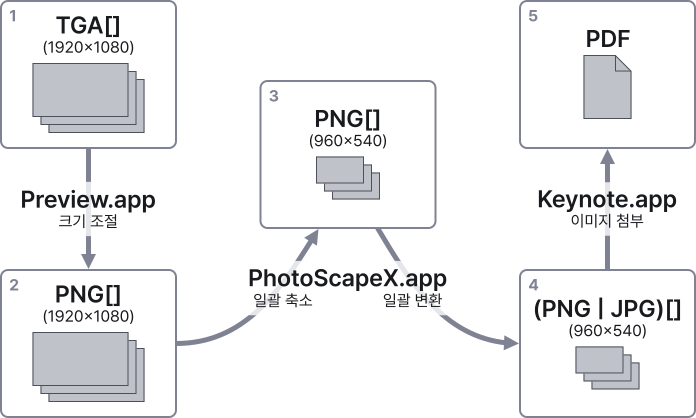

## 목표와 계기

목표는 Windows용 방송 자막 편집·송출 프로그램인 ‘GenCG’에서 자막 파일의 내용을 TGA 형식의 이미지로 내보낸 것을 PDF로 묶어 내는 웹 앱을 만드는 것이었다. 이런 목표를 세우게 된 계기는 다음과 같다.

1. GenCG 없이 어떤 기기에서든 자막 파일의 내용을 확인할 수 있게 하고 싶었다.
2. 공유되는 파일 크기를 더 줄이고 싶었고, 그 내용을 한 파일에서 확인 가능하게 하고 싶었다.
3. 위의 절차를 한번에 하고 싶었다.

### 1. GenCG 없이 어떤 기기에서든 자막 파일의 내용을 확인할 수 있게 하고 싶었다.

GenCG에는 ‘이미지로 저장’ 기능이 있는데, TGA, JPEG, BMP 포맷만 지원한다. 이들 중 기본 포맷은 32비트 TGA이며, 압축 없이 저장한다. 그러나 Windows의 탐색기와 기본 이미지 뷰어로는 TGA 파일의 내용을 확인할 수 없고, 일괄 변환을 하려면 별도의 앱이 필요하다. TGA 포맷을 지원하는 양질의 무료 이미지 뷰어가 있지만, 알파 채널을 제대로 인식하지 못하는 듯했다. 따라서 TGA 이미지를, 어떤 환경에서든 볼 수 있는 포맷으로 변환하고 싶었다. <small>(JPEG 포맷은 압축 포맷이지만 알파 채널을 지원하지 않는다. BMP 포맷은 알파 채널을 빼고 저장하는 건지 뷰어나 컨버터에서 알파 채널을 못 처리하는 건지 모르겠다.)</small>

### 2. 공유되는 파일 크기를 더 줄이고 싶었고, 그 내용을 한 파일에서 확인 가능하게 하고 싶었다.

그동안 파일 크기를 줄이기 위해서 이미지 크기(Dimension)를 줄였고, 한 파일에서 확인 가능하게 하기 위해서 PDF로 묶었다. 그 절차는 다음과 같다.

1. **비손실 압축**: macOS의 기본 이미지 및 PDF 뷰어 앱인 미리보기(Preview) 앱에서 ‘파일 - 선택한 이미지 내보내기’ 기능을 이용하여 PNG로 일괄 저장한다.
2. **축소**: PNG로 저장한 것을 PhotoScape X 앱으로 열어서, 이미지 크기를 1/3이나 1/2로 일괄 축소한다.
   - 미리보기 앱에서 ‘도구 - 크기 조절’ 기능으로 일괄적으로 크기를 줄일 수도 있지만, 이렇게 하면 변경 사항을 저장할 것인지를 **각 파일마다** 묻는다. 자막 파일이 100페이지 이상 나오기 때문에, 일괄 축소는 다른 앱을 이용했다.
3. **압축 효율에 따른 일부 포맷 변경**: PNG 압축 시 효율이 좋지 않은 페이지 중 화면 전체를 덮는 페이지는 JPEG 포맷으로 변환한다.
4. **한 파일로 묶기**: 결과물을 모두 선택하고 Keynote로 끌어와서 PDF로 내보낸다. 이 단계를 위해서 회색 배경과 함께 페이지 번호 표시가 있는 Keynote 템플릿도 만들어 두었다.

### 3. 위의 절차를 한번에 하고 싶었다.

GenCG는 Windows용 프로그램이다. 거기서 뽑아 낸 TGA 파일을 압축 이미지 포맷으로 변환하고, 가로·세로 크기를 줄이고, PDF로 묶는 작업은 macOS로 옮겨 와서 진행했다. 일주일에 한 번 하는 과정이지만, 페이지 수가 많다 보니 각 절차 사이에 기다리는 과정이 끼어서 꽤 번거로웠다.

---

## 개발 과정

> 최종 결과물은 [https://yejunian.github.io/gencg-exported-image-group/](https://yejunian.github.io/gencg-exported-image-group/)에서 확인할 수 있다. 나중에 수정 사항이 생기면 여기서 말한 것과 달라질 수 있다.

사실, 이건 작년 중반에 만들려고 했었다. 하지만 점점 산으로 가다가 버려졌다. 굳이 초기에 구현하지 않아도 될 기능을 이것저것 끼워넣으면서, 기초적인 목적과 본질을 상실하면서 뭘 하려고 했었는지 잊어버렸기 때문이다. 산으로 간 걸 되살려서 진행할 엄두가 나지 않아서 처음부터 다시 만들었다.

그래서 이번에는 이렇게 하기로 했다.

- 최소한의(정말 필요한) UI만 작성한다.
- 필요한 핵심 기능만 우선 설계·구현한다.
  - 추가되면 좋을 만한 내용은 따로 메모해 두었다가 핵심 기능 구현 후에 적용한다.
- 구현해야 하는 내용을 명확하게 구체화한다.

여기에 더해서, 해커톤에서 하는 것처럼 가능한 빨리 만들어 보기로 했다. 그렇게 하지 않으면 지난번처럼 질질 끌게 될 것 같았기 때문이다.

### 기본 기능 구현

핵심 기능을 다음과 같이 정하고 구현했다.

1. TGA 파일 읽기
2. 이미지 축소
3. PDF 생성

거의 라이브러리를 가져다 써서 만들었다. 혹시라도 라이브러리가 없거나 마음에 들지 않으면 만들어 봐야겠다는 생각을 했지만, 그런 일은 일어나지 않았다. 특히 3번 관련 라이브러리가 없었다면 PDF가 아니라 Base64 이미지가 잔뜩 들어간 단일 HTML 파일 생성으로 방향이 틀어졌을지도 모르겠다.

#### 1. TGA 파일 읽기

TGA 포맷을 읽기 위해서 [tga-js](https://www.npmjs.com/package/tga-js)를 활용했다. 처음에는 PNG로 변환한 결과를 Base64 문자열로 받았는데, 나중에는 배경색과 합치기 위해서 `<canvas>` 엘리먼트를 받는 방식으로 변경했다.

#### 2. 이미지 축소

이미지 축소는 [browser-image-compression](https://www.npmjs.com/package/browser-image-compression)을 활용했다. 보간 방법이 어떻게 되는지는 모르겠지만, 이미지의 가로와 세로를 각 1/3로 줄였을 때의 결과물에서 계단이 보였다. 그래서 이것 대신에 직접 `<canvas>`를 활용하여 줄여 보기도 했는데, 이미지 파일 크기 감소 비율은 이 모듈이 훨씬 좋았다. 계단이 보이더라도 내용을 보는 데는 전혀 문제가 없었고, 1/2로 줄이면 계단 현상이 덜했으며, 애초에 자막 파일의 ‘초안’을 공유하는 것이 목적이었기 때문에 이 모듈을 계속 쓰기로 했다.

#### 3. PDF 생성

PDF 생성은 [jspdf](https://parall.ax/products/jspdf)([npm](https://www.npmjs.com/package/jspdf))를 활용했다. 각 페이지마다, 배경으로 쓸 회색 직사각형을 그린 뒤에 축소한 이미지를 얹었다.

### 기능 추가 및 개선

핵심 기능을 구현한 뒤에는, 추가로 떠오른 기능을 하나둘 구현했다.

1. 페이지 번호 표시
2. 처리 과정 변경
3. 결과 파일 크기 개선
4. 진행도 가중치
5. 사용자 설정

#### 1. 페이지 번호 표시

지금까지의 결과물은 이미지를 순서대로 각 페이지에 나열하기만 한다. 보고 있는 페이지가 몇 페이지인지를 확인하려면 PDF 뷰어의 다른 UI를 참고해야 한다. 따라서 각 페이지의 오른쪽 위 부분에 페이지 번호가 붙게 했다.

다만, 텍스트를 Fill And Stroke 방식으로 그리면 Stroke가 Fill을 가려서 페이지 번호가 어색하게 보였다. 텍스트의 Stroke를 먼저 그린 뒤, 같은 자리에 Fill을 그리는 방식으로 문제를 해결했다.

#### 2. 처리 과정 변경

그동안 이미지 처리를 두 단계로 진행했다.

1. TGA 파일 선택 시: TGA를 PNG로 변환
2. ‘PDF 생성’ 버튼 클릭 시: 이미지 축소 및 PDF 빌드

하지만 다음과 같은 문제가 있었다.

- 파일을 잘못 선택하더라도 1단계 작업이 진행되고, 취소할 수 없다. 파일을 다시 선택하려면 작업이 완료될 때까지 기다려야 한다.
- 1단계와 2단계를 구분하는 기준에 설득력이 없다. <small>(별다른 이유 없이 그냥 정했기 때문이다.)</small>
- 처리 과정이 한번에 이루어지지 않는다. <mark>(1) 파일을 선택할 때</mark>와 <mark>(2) ‘PDF 생성’ 버튼을 눌렀을 때</mark>, 총 두 번을 기다려야 한다.
  - ‘TGA 로드 → PNG 변환 → 이미지 축소’ 과정은 개별 파일 단위로 한번에 진행할 수 있다. 굳이 두 번 기다릴 이유가 없다.

그래서 TGA 파일을 선택했을 때는 파일 객체 배열만 기록해 두었다가, ‘PDF 생성’ 버튼을 눌렀을 때 모든 처리를 진행하도록 변경했다.

#### 3. 결과 파일 크기 개선

자막 파일의 일부 페이지에는 JPEG 이미지 리소스가 들어 있다. 그 외에도 PNG보다는 JPEG 쪽이 압축 효율이 좋은 페이지가 일부 존재할 수 있다. 이런 페이지를 PNG로 압축했을 때, 경험적으로 효율이 좋지 않았다.

따라서 이미지를 축소한 뒤 배경색을 합성한 것을 PNG와 90% JPEG으로 압축하고, 파일 크기를 비교하여, 정해 둔 기준에 따라 한 포맷을 선택하도록 수정했다. 단, PNG가 비손실 압축 포맷이므로 웬만하면 PNG를 쓰려고 했다.

- PNG 크기가 JPEG 크기의 1.1배 이하인 경우 PNG 사용
- 그 외에는 JPG 사용

#### 4. 진행도 가중치

PDF를 빌드하는 동안 페이지가 멈춘 것처럼 보이지 않게 하기 위해 진행도를 표시했다. 처음에는 한 이미지의 한 단계를 처리할 때마다 동일한 비중으로 진행도를 올리려 했다. 하지만 진행도가 어떤 단계에서는 천천히 올랐고, 어떤 단계에서는 너무 빨리 올랐다. 그래서 단계별로 걸리는 <small>(Outlier를 제외한)</small> 평균 시간을 `console.time()` 등으로 측정해서, 단계별 진행도 가중치를 정의하여 반영했다.

#### 5. PDF 출력 설정

PDF 출력 설정은 중간중간 추가했다. 초기에는 값을 고정해 두었던 배경색, 페이지 번호 표시 여부, PDF 크기를 사용자가 직접 지정할 수 있도록 변경했다. 이 과정은 난이도가 어렵지 않았다. 컴포넌트에 State를 추가하고 PDF 생성 과정과 UI에 반영한 것이 전부였다.

### `gh-pages`를 이용하여 GitHub Pages로 배포

여기서 실수를 했다. `main` 브랜치에서 [gh-pages](https://www.npmjs.com/package/gh-pages)를 이용하여 GitHub Pages로 배포를 하긴 했는데, 실제 배포된 환경에서 React 앱이 초기화되지 않는 것을 발견했다. 잠시 고민하면서 이전에 만들었던 React 앱들을 살펴보다가, `package.json`에서 `homepage` 필드를 설정하지 않았다는 것을 깨달았다.

Create React App 공식 문서의 [Deployment 페이지의 ‘Building for Relative Paths’ 문단](https://create-react-app.dev/docs/deployment/#building-for-relative-paths)에 따르면, `package.json`의 `homepage`를 통해서 생성물의 루트 경로를 추론한다고 한다. ‘GitHub 저장소를 위한 GitHub Pages’처럼 서브 디렉터리를 루트로 사용하는 경우 이 필드를 설정해야 한다.

### 추후 계획

- 퍼포먼스 최적화(시간, 메모리): 이미지를 처리하는 데 시간이 꽤 걸린다. 메모리도 많이 사용한다. 메모리 누수도 있는 것 같다. 따라서 할 수 있는 선에서 최적화를 해 보고 싶다.
- 파일명에서 페이지 번호를 인식하여 PDF에 반영: GenCG에서 ‘그림으로 저장’ 기능으로 이미지 파일을 뽑아내면 실제 파일명은 `{name}{xxxxx}.{extension}` 형태로 나온다. 여기서 `{xxxxx}`를 뽑아내면 해당 이미지의 페이지 번호를 알 수 있다.
- 코드 분리: 지금은 거의 한 파일에 모든 내용이 들어 있다. 이걸 기능 단위로 분리하고 싶은데, Hook 관련 내용이 엮여 있어서 고민을 좀 해 봐야 할 것 같다.

---

## 소감

핵심 기능부터 구현하면 이렇게 금방 끝낼 것을, 과거에는 너무 질질 끌다가 산으로 갔다. 이번에는 요구사항을 나열하고 필수 기능을 선정하는 데 2시간 정도 쓴 것 같다. 최소 기능인 ‘TGA → PNG 변환 → PDF 빌드’는 5시간 만에 구현했다. 그 뒤로 기능을 조금씩 추가 구현했다. 7시간 동안 최소 기능을 구현했고, 이틀에서 사흘 안에 웬만한 기능은 다 구현했다.

이런 과정을 통해서 <mark>기능을 정의한 뒤에 중요도 순서를 정해서 진행하자는 교훈</mark>을 얻었다. 몇 차례 과제 테스트를 보면서 배운 것이기도 하다. 역시 일할 때만큼은 체계적으로 해야 쉽게 흐지부지되지 않는다.
